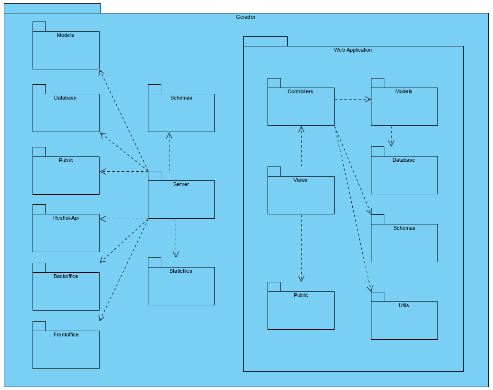

# Manual de Técnico - _Gerador de Web Applications_

**Realizado por:**

Diogo Sénico nº180221077<br>
Pedro Ribeiro nº180221091<br>
Samuel Carlos nº180221076<br>

## Indice

- [Manual de Técnico - _Gerador de Web Applications_](#manual-de-técnico---gerador-de-web-applications)
  - [Indice](#indice)
  - [Introdução](#introdução)
  - [Arquitetura do Sistema](#arquitetura-do-sistema)
  - [Componentes do projeto](#componentes-do-projeto)
    - [Gerador](#gerador)
    - [Web Application](#web-application)
  - [Templates Mustache](#templates-mustache)
    - [Views](#views)
    - [Scripts](#scripts)
  - [Descrição técnica](#descrição-técnica)
    - [Soluções implementadas](#soluções-implementadas)
    - [Configurações utilizadas](#configurações-utilizadas)
    - [Extras implementados](#extras-implementados)
  - [Análise das secções mais importantes](#análise-das-secções-mais-importantes)
  - [Limitações existentes](#limitações-existentes)
  - [Descrição dos modelos](#descrição-dos-modelos)

## Introdução

---

O presente manual técnico tem como objetivo descrever o funcionamento e as decisões tomadas à cerca do gerador de web applications construido.
A aplicação pretende ser um gerador que apartir da especificação de modelos e das suas relações, pretende gerar uma web application que tornará possivel a realização de operações CRUD sobre os elementos criados.
A geração tornará possivel criar páginas de listagem, inserção, edição e também uma frontpage para listagem de alguns modelos escolhidos pelo utilizador de acordo por uma ordenação e limite de dados escolhidos pelo mesmo.
Estas páginas obedecem todas a um template que também poderá ser editado pelo utilizador antes da geração da web application

## Arquitetura do Sistema

---


Com o presente diagrama pretendemos demonstrar como está o gerador organizado em termos dos diversos componentes envolvidos. Podemos observar neste esquema que existe dentro do gerador um componente "Web Application" que é aquele que o mesmo gerador irá criar e executar. Dentro do mesmo é possivel visualizar as relações entre os respetivos componentes e concluir que este usa uma arquitetura MVC. Quando ao gerador em si este gira em torno do componente "Server" que é aquele responsável por executar todos os "sub-geradores" da Web Application

## Componentes do projeto

---

O gerador é composto por diversos componentes que têm como finalidade a geração das diversas partes da web application sendo eles:

### Gerador

-   **server**: Este é o componente principal de todo o gerador. é aqui que é realizada toda a integração com os restantes componentes da aplicação. Este componente exporta a função _generateServer_ que apaga a aplicação que foi previamente gerada e cria toda a estrutura de pastas para a nova WebApp bem como executa os restantes componentes e por fim executa a App gerada.
-   **class**: Neste componente temos como objetivo a criação das diversas classes da aplicação gerada. Estas classes obedece todas a um template (mencionado mais à frente) e todas com base no modelo dado em JSONSchema.
-   **database**: Tal como o nome indica o componente da database é responsável por gerar e executar as queries para a criação dos elementos da BD em SQLite. Este componente é responsável por exportar duas funções sendo a primeira resposável pela criação das tabelas e a segunda pela criação das relações entre as mesmas.
-   **restful-apis**: O componente da api tem como objetivo gerar os Routers utilizados pelo frontend da aplicação gerada. Este componente gera um ficheiro para cada modelo introduzido pelo utilizador
-   **backoffice**: No componente de backoffice temos uma função geradora das vistas que compoem toda a parte de backend da aplicação, ou seja, as views das listas, inserções, edições.
-   **frontoffice**: Temos também a componente relacionada com a geração das views frontoffice, nomeadamente a página home com as respetivas tabelas especificadas pelo utilizador antes da geração da aplicação
-   **staticFiles/schemas**: Estes dois são componentes que contêm a especificação de templates e modelos que serão usados para gerar a aplicação
-   **public**: Por fim temos o componente do gerador responsável pela apresentação de uma página ao utilizador para que este consiga editar algumas das configurações do gerador. Estas páginas incluem funcionalidades como a gestão dos schemas (Operações CRUD), edição do template da página gerada, especificação de quais os modelos a serem apresentados na frontpage da aplicação e por fim a própria opção para gerar a WebApp.

### Web Application

-   **controllers**: O presente componente é aquele que contem todos os routers para cada modelo da aplicação bem como é onde são geradas as views de frontoffice e backoffice
-   **models**: É o componente que contém todas as classes referentes aos modelos da aplicação gerada.
-   **database**: Aqui neste componente temos as ferramentas para a realização do acesso e execução de queries à BD e também a respetiva Base de Dados em SQLite
-   **views**: As views são o componente que aglomeram todos os templates presentes na aplicação e que são consequentemente utilizados pelo controller
-   **public**: No public é onde são guardados todos os elementos estáticos da WebApp como as imagens, estilis css, entre outros.
-   **schemas**: Temos também os schemas onde estão situados todos os modelos usados na nossa WebApp
-   **utils**: Para além disto tudo temos também um componente responsável pela onde são guardadas certas funcionalidades utilitárias para evitar a repetição constante de código

## Templates Mustache

---

Numa visão geral todos estes templates foram construidos com base na framework Bootstrap e de forma a que a aplicação seja também Responsive.
Em termos de estrutura todos estes contêm uma Navbar que é o menu da aplicação e também um componente "container" que aglomera e centra o conteudo na página.

### Views

**Template "details"**<br>
O presente template tem como objetivo apresentar ao utilizador o conteudo de um dado modelo mostrando uma lista de chaves e valores em diferentes modos de apresentação.
Neste template temos também no seu fundo uma secção que permitirá ao utilizador visualizar, caso existam, as relações entre outros modelos sendo que poderá navegar para os respetivos detalhes da dada referência.
Input:

**Template "edit"**<br>
O template de edição é aquele responsável pela construção de um formulário que é carregado inicialmente com os dados de um registo pedido.
Existem neste formulário diversas formas de realizar inserções de dados que vão dependendo do tipo dos mesmos. Quando ao input para os dados das referências temos select inputs para referencias do tipo "1-1" e "M-1" e temos checkbox inputs para referências do tipo "M-M".

**Template "home"**<br>
O template home é o frontoffice da aplicação. Este template é utilizado para renderizar a respetiva página de Home que contem uma listagem de tabelas escolhidas pelo utilizador e cada uma com uma ordenação especifica.

**Template "insert"**<br>
Este template é muito similar ao já falado template de edição porém este não inclui qualquer tipo de carregamento inicial de dados.

**Template "list"**<br>
A list é o template usado para a listagem dos dados numa tabela. Nesta página temos como opções, navegar para a página de inserção de um novo registo, pesquisa por elementos da tabela (pesquisa por qualquer dado em qualquer coluna) e por cada registo da tabela existem ações que se podem realizar sobre esse mesmo registo nomeadamente, visualizar a página de detalhes, realizar a edição dos dados do registo e também apagar o mesmo.

**Template "menu"**<br>
Por ultimo temos o template de menu que é aquele usado por todos os outros templates referidos anteriormente como a forma de um mustache partial.

### Scripts

**Template "backoffice"**<br>
O template de backoffice tem como objetivo gerar todos os endpoints relativos às views do backoffice, nomeadamente os endpoints que renderizão os templates das views mencionados anteriormente.

**Template "dbscript"**<br>
O presente template é a base da criação das tabelas da base de dados SQLite

**Template "add-foreign-key"**<br>
Este template destina-se à criação de um script para a criação de chaves estrangeiras entre as tabelas

**Template "many-to-many-table"**<br>
No seguinte template é criada a tabela e respetivas relações entre as respetivas tabelas da relação do tipo "M-M"

**Template "unique-index"**<br>
Quando ao presente template temos um script SQLite que cria um Unique Index na tabela originaria da relação de modo a se realizar um comportamenteo de "1-1"

**Template "frontoffice"**<br>
No template de frontoffice temos a geração dos endpoints respetivos à página Home da aplicação. Este template tem como objetivo a listagem de tabelas na front page baseadas nos critérios de ordenação dados pelo utilizador antes da geração da aplicação

**Template "class"**<br>
Quanto ao template de classes é aquele que gera as propriedades que cada modelo necessita bem como os metodos para realizar operações CRUD sobre os mesmos na Base de Dados

**Template "api"**<br>
Temos também na aplicação um template para cada Router utilizado pela aplicação. Cada router utilizado terá endpoints para as operações básicas CRUD.

**Template "server"**<br>
Por ultimo o template do servidor da aplicação gerada. É neste que é especificado o código que posteriormente iniciará o servidor da aplicação gerada

## Descrição técnica

---

### Soluções implementadas

**Código sincrono na gestão de ficheiros**<br>
Para evitar o chamado "callback hell" e também a criação de conteudo com uma ordem imprópria foi se optado pela adoção do padrão Async/Await num vasto leque de funcionalidades da app, mas este foi particularmente utilizado no componente principal de criação do servidor (server.js). Este componente é aquele onde é realizada a maior parte da manipulação de ficheiros e é também aquele que chama os restantes módulos que poderão também realizar operações do género.<br>
O seguinte excerto de código é um exemplo da adoção do padrão. Este foi um exemplo retirado da função de cópia de _static files_:

```javascript
Object.keys(config.staticFiles).forEach(async name => {
    try {
        await fs.copyFile(
            `.${config.staticFiles[name].originalPath}`,
            `./${config.baseGenFolder}${config.staticFiles[name].destinationPath}`
        );
    } catch (e) {
        console.log('Error catched', e);
    }
});
```

**"Callback hell" em chamadas à BD**<br>
Tal como referido anteriormente uma das preocupações no desenvolvimento do gerador foi evitar o chamado "Callback Hell". No acesso à Base de Dados esta foi uma das tarefas que levou a uma adoção de uma estratégia que usaria Promises visto que as chamadas à BD são à base de callbacks.
Um exemplo da adoção desta estratégia está bastante visivel no template de frontoffice que posteriormente poderá gerar o seguinte código:

```javascript
res.render('home', {
    schemas: menuItems,
    tables: [
        {
            title: 'Album',
            limit: '3',
            orderText: 'DESC' === 'ASC' ? 'Ascendent' : 'Descendent',
            rows: await new Promise(res => {
                Album.top('name', 'DESC', 3, rows => {
                    res(fetchRows(rows));
                });
            }),
            columns: Object.keys(new Album()).map(
                col => AlbumSchema.properties[col].label
            ),
        },
    ],
});
```

**Obtenção do ID de um registo**<br>
No caso da obtenção do ID (um campo gerado por default em todos os modelos) de um dado registo, existia o problema em que esta propriedade não era enumerável o que conduzia a esta não ser diretamente acedida e por vezes era necessário aceder ao seu valor. Para solucionar este problema optou-se pela seguinte abordagem, encontrada no código gerado pelo componente da API

```javascript
Album.all(rows =>
    res.json(
        JSON.parse(
            JSON.stringify(rows, Object.keys(new Album()).concat(['id']))
        )
    )
);
```

**Input Types e Presentation Modes**<br>
No caso das opções de visualiação de certos conteudos como, elementos de input e elementos de visualização, foi optado por na propriedade do schema do modelo se usar o "type" como uma forma de interpretar que tipo de elemento de input seria apresentado e foi usado o "presentatioMode" em conjunto com o "type" para indicar de que modo o mesmo seria apresentado nos detalhes do registo.
Os seguintes excertos de código demonstram como foram feitas as transformações de type/presentationMode para os respetivos elementos HTML.

```javascript
function presentationModeToHtmlString(mode, value, type) {
    switch (mode) {
        case 'image':
            return (
                value &&
                `<br>`
            );
        case 'video':
            return (
                value &&
                `<br>
                <div class="embed-responsive embed-responsive-16by9">
                    <iframe class="embed-responsive-item" width="345" src="${value}">
                    </iframe>
                </div>`
            );
        default:
        // [...] Criação do modo de apresentalção baseado no Type
    }
}
function schemaTypeToInputType(type) {
    switch (type) {
        case 'string':
            return 'text';
        case 'boolean':
            return 'checkbox';
        case 'integer':
            return 'number';
        case 'datetime':
            return 'datetime-local';
        default:
            return type;
    }
}
```

**Atualização de valores em tabelas de referencias "M-M"**<br>
Um dos problemas encontrados para a inserção/atualização dos registos está relacionado com as relações "M-M" entre tabelas. Nestas relações é necessário atualizar uma tabela intermédia onde são apagados os dados antigos referentes ao registo atual e adicionados posteriormente os novos. Para ocorrer este processo é necessário que exista o ID do registo que se pertende atualizar na tabela intermediária, porém no caso de uma insersão nova de um registo este id só pode ser obtido após a query ter sido finalizada. Sabendo isto a abordagem que se adotou foi a execução de uma query no callback da inserção de um novo registo que retorna-se o ultimo ID inserido na tabela respetiva.

```javascript
let obj = Object.assign(new Album(), req.body);
obj.save(msg => {
    if (!msg.success) return res.json(msg);
    Album.getLastInserted(row => {
        const jsonRes = JSON.parse(
            JSON.stringify(row, Object.keys(new Album()).concat(['id']))
        )[0];
        for (const ref of AlbumSchema.references) {
            const col = `${ref.model}_id`.toLowerCase();
            if (ref.relation === 'M-M' && req.body[col].length) {
                Album.manySave(ref.model, jsonRes.id, req.body[col]);
            }
        }

        res.json(msg);
    });
});
```

### Configurações utilizadas

Em termos de configurações usadas na aplicação temos a seguinte estrutura no ficheiro config:

```JSON
{
	"port": "[Numero da porta do servidor gerado]",
	"dbname": "[Nome da BD gerada]",
	"schemas": [
		{
			"name": "[Nome de um dos módulos a ser gerado]",
			"path": "[Caminho para o respetivo módulo]"
		},
	],
	"frontoffice": [
		{
			"model": "[Modelo a ser apresentado no frontoffice]",
			"property": "[Propriedade para ordenar]",
			"order": "[Ordenação ASC ou DESC]",
			"limit": "[Limite de registos a serem mostrados]"
		},
	],
	"baseGenFolder": "[Nome da pasta de destino do gerador]",
	"staticFiles": {
		"[nome arbirtário]": {
			"originalPath": "[caminho original do ficheiro]",
			"destinationPath": "[caminho de destinho do ficheiro após a cópia]"
		},
	}
}
```

### Extras implementados

-   **Labels para propriedades**: Em cada propriedade do modelo é necessário introduzir um Label que será utilizado como o nome a ser apresentado em todas as views da aplicação
-   **Descrição para cada propriedade**: Nos formulários de inserção/edição é possivel, ao passar o rato pelos Labels de cada propriedade é possivel obter as descrições associadas às mesmas
-   **Redirecionamento nas referências**: Na página de detalhes de um registo é possivel, na secção de referências, caso exista, obter um link que nos redirecionará paraa página do respetivo registo associado
-   **Live preview do Style Switcher**: No editor de tema da aplicação é possivel, para além de editar alguns dos estilos da aplicação gerada, visualizar uma privew dessas mesmas mudanças em tempo real na mesma página
-   **Live preview do editor de schemas**: Para além da preview no editor do tema da aplicação é possivel também ter uma preview em tempo real no editor de schemas que permite visualizar o JSON schema que será gerado
-   **Editor de tabelas do frontoffice**: Por fim temos o editor de frontoffice que faz parte das páginas de costumização da aplicação gerada. Nesta página é possivel escolher que tabelas poderão aparecer na página do frontoffice e qual a ordenação e limite de registos disponiveis nas mesmas

## Análise das secções mais importantes

---

Como secções importantes de código no projeto podemos destacar 2.
Destacamos então o código do endpoint de backoffice para renderização da view edit onde neste caso usaremos um exemplo já gerado para uma melhor compreensão do código:

```javascript
router.get('/Album/Edit/:id', function (req, res) {
    Album.get(req.params.id, function (row) {
        res.render('edit', {
            title: 'Album',
            schemas: menuItems,
            id: req.params.id,
            properties: Object.getOwnPropertyNames(row)
                .filter(prop => AlbumSchema.properties.hasOwnProperty(prop))
                .map(prop => ({
                    type: schemaTypeToInputType(
                        AlbumSchema.properties[prop].type
                    ),
                    isCheckbox:
                        schemaTypeToInputType(
                            AlbumSchema.properties[prop].type
                        ) === 'checkbox',
                    isRange:
                        schemaTypeToInputType(
                            AlbumSchema.properties[prop].type
                        ) === 'range',
                    required: AlbumSchema.required.includes(prop),
                    attrs: columnConstraintToHtmlAttrs(
                        AlbumSchema.properties[prop]
                    ),
                    name: prop,
                    value: row[prop],
                    label: AlbumSchema.properties[prop].label,
                })),
            references: Object.getOwnPropertyNames(row)
                .filter(prop =>
                    AlbumSchema.references.find(
                        ref => `${ref.model}_id`.toLowerCase() === prop
                    )
                )
                .map(prop =>
                    AlbumSchema.references.find(
                        ref => `${ref.model}_id`.toLowerCase() === prop
                    )
                )
                .map(ref => ({
                    name: `${ref.model}_id`.toLowerCase(),
                    label: ref.label,
                    model: ref.model,
                    values:
                        ref.relation === 'M-M'
                            ? 'Album/' + req.params.id
                            : row[(ref.model + '_id').toLowerCase()],
                    isManyToMany: ref.relation === 'M-M',
                })),
            get hasReferences() {
                return this.references.length > 0;
            },
        });
    });
});
```

Consideramos o excerto de código anterior dos mais importantes devido ao seu grau de complexidade uma vez que são necessários enviar para a view de edição imensos tipos de dados diferentes cada um com a sua utilidade. Neste código podemos observar que são utilizados vários mecanismos diferentes para que a view possa saber exatamente como demonstrar os dados como, por exemplo, a propriedade "isCheckbox" ou a "isRange" que irá permitir à view distigir entre estes tipos de inputs. Também podemos observar já na propriedade de referencias, a sub propriedade values onde é verificada se a relação da referencia é do tipo "M-M" e caso seja é enviado o link para a realização da request a essa referência e caso contrário é enviado o próprio valor da referência.

Outra das regiões que achamos importante mencionar está localizada no router do frontoffice. Iremos usar um código de um exemplo gerado para a explicação do mesmo.

```javascript
async function frontoffice(req, res) {
    res.render('home', {
        schemas: menuItems,
        tables: [
            {
                title: 'Album',
                limit: '3',
                orderText: 'DESC' === 'ASC' ? 'Ascendent' : 'Descendent',
                rows: await new Promise(res => {
                    Album.top('name', 'DESC', 3, rows => {
                        res(fetchRows(rows));
                    });
                }),
                columns: Object.keys(new Album()).map(
                    col => AlbumSchema.properties[col].label
                ),
            },
        ],
    });
}
```

Neste excerto de código gerado é possivel visualizar a forma como foi ultrapassado o problema da utilização de callbacks para a execução de queries na base de dados. Era um fator importante ultrapassar aqui essa dificuldade uma vez que queriamos evitar um "callback hell" tendo execuções de queries "infinitas" encadeadas entre si.

## Limitações existentes

---

Em termos de limitações no nosso projeto podemos destacar duas principais sendo a primeira o facto da eliminação de um registo de um modelo que seja referenciado num outro, não dá nenhum tipo de feedback com tal informação e o registo onde se situa essa referência não sobre nenhum tipo de impacto ficando assim a "apontar" para um registo inexistente.
A segunda limitação do gerador criado tem está ligada ao facto de qualquer tipo de alteração nos modelos não é refletida na lista de modelos a serem utilizados na página de frontoffice, desta forma, se por exemplo, um modelo referenciado para carregar nessa página for apagado a aplicação continuará a tentar carregar esse modelo para o frontoffice.

## Descrição dos modelos

---

Para a implementação base do gerador foram implementados 4 modelos base:

-   **Album**: O modelo _Album_ representa os dados caracteristicos de um album musical tal como o Nome, Descrição, Data de lançamento e Capa. Temos também como referência aqui o Modelo do Artista. É relevante também mencionar o tipo de dados e o modo de apresentação da propriedade capa onde temos um Tipo de dados URL o que irá levar a apenas ser possivel inserir URLs neste campo e este url será apresentado nos detalhes de um registo como uma imagem.
-   **Artist**: O modelo do _Artist_ tem como objetivo realizar uma representação de um artista musical tendo este atributos como Nome e Email de contacto
-   **Genre**: Quando ao modelo do _Genre_ temos aqui uma representação de um genero musical tendo este apenas a propriedade do nome do genero
-   **Song**: Por fim o modelo mais completo e complexo é o _Song_ que representa, tal como o nome indica, uma musica. Este modelo tem como propriedades o Nome da musica, a descrição, a duração (em segundos), a letra, a data de lançamento e o próprio videoclip que neste caso terá de ser um tipo URL e será apresentado como video nos detalhes da musica (Como particularidade o video apenas funcionará caso o link solicitado seja um Embed link). Neste modelo também existem duas relações sendo ambas de "1-M" com os modelos _Album_ e _Genre_
