# Manual de Utilizador - Gerador de aplicações web

### Realizado por:

Diogo Sénico nº180221077 
Pedro Ribeiro nº180221091 
Samuel Carlos nº180221076

## Indice

-   [Introdução](#Introdução)
-   [Instalação e Utilização ](#Instalação-e-utilização)
    -   [Instalação](#Instalação)
    -   [Utilização do programa](#Utilização-do-programa)
-   [Input/Output](#Input/Output)
    -   [Adicionar mais tabuleiros](#Adicionar-mais-tabuleiros)
    -   [Outputs](#Outputs)
-   [Limitações Técnicas](#Limitações-Técnicas)

## Introdução

---

Este manual tem como objetivo ajudar o utilizador a entender a forma como deve interagir com o programa desenvolvido e compreender o seu funcionamento de forma integra e objetiva.
Começaremos por explicar que o programa desenvolvido pode ser visualizado do ponto de vista do utilizador em 2 partes, sendo estas:

-   O gerador, esta parte será onde o utilizador que pretende gerar uma aplicação web puderá "desenvolver" . Aqui será possivel criar, visualizar, alterar e apagar os modelos e as relações entre os mesmos utilizando o editor de schemas, será tambem possivel alterar os estilos da página a ser gerada e por fim é tambem possivel escolher que entidades aparecerem em destaque na página principal/inicial.
-   A aplicação gerada, em relação a esta segunda parte que puderá ser acedida após o utilizador ter gerado a aplicação, aqui poderá ser realizado as operações comuns CRUD de backoffice sobre as entidades definidas na parte anterior e será tambem possivel visualizar os destaques da página inicial.

## Instalação e utilização

---

### Instalação

Primeiramente para que possa utilizar o programa é necessário possuir o NodeJS (juntamente com o npm) instalado no seu computador, de seguida a instalar o mesmo basta dirigir-se há pasta do projeto e instalar as dependencias do mesmo correndo o seguinte comando no terminal `npm install`.

### Utilização do programa (Gerador)

#### Inicialização do gerador

Após instalar todas as dependencias do projeto para inicializar o mesmo basta apenas correr o comando `node index` no terminal.  
Isto irá inicializar o servidor web (gerador) no seu computador ao qual puderá aceder através de um browser dirigindo-se ao url "localhost:8081".

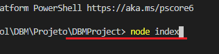

#### Página inicial

Depois de o programa ter sido inicializado e tenha acedido ao url indicado acima irá ser apresentada a seguinta página:

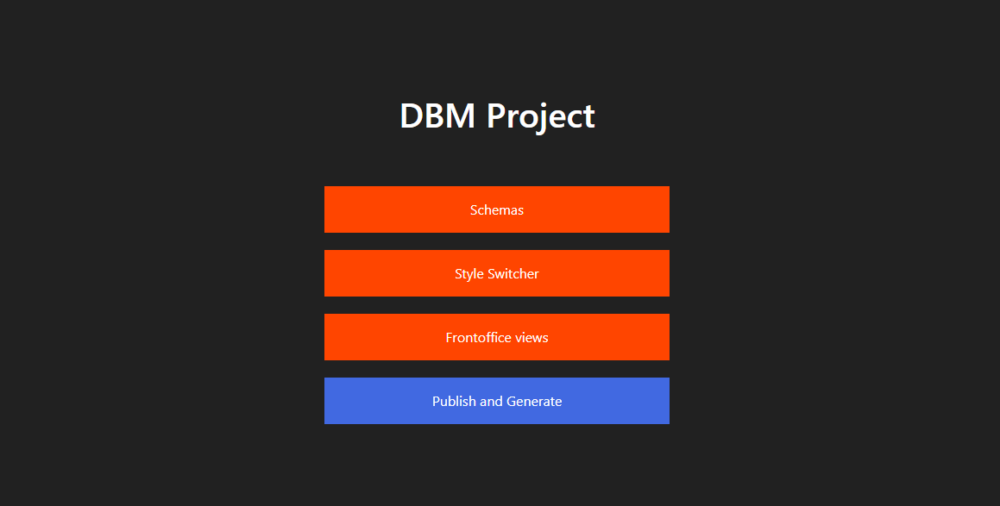

Nesta página como pode ser visualizado é um simples menu que irá possibilitar visitar todas as funcionalidades relacionadas com o gerador. Estas funcionalidades irão ser explicadas mais detalhadamente de seguida.

#### Schemas / Schemas Editor

Iremos começar pela primeira opção do menu que é o editor de schemas, este editor possui duas páginas distintas:

Ao clicar na opção da página inicial será redirecionado para a **página de listagem de schemas** onde podem ser visualizados todos os schemas já criados e onde existem alguns botões para realizar ações sobre os mesmos. Abaixo encontra-se essa página na figura.

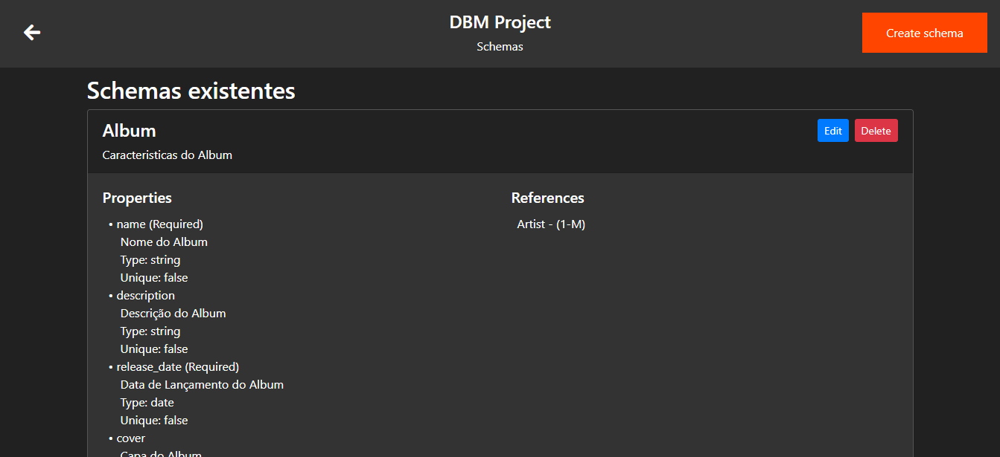

Como pode ser observado na figura existe uma listagem de schemas sendo que no canto de cada schema existem 2 butões que servem para editar e remover respetivamente.  
Outra ação possivel será no canto superior direito da página onde pode ser visualizado um botão para criação de um novo schema.  
Ambos os botões de edição e criação de schemas irão redirecionar para a segunda página mencionada anteriormente.  
Esta segunda página será o editor em si onde se pode criar/editar um schema. Na figura abaixo pode ser visualizado o editor desenvolvido.

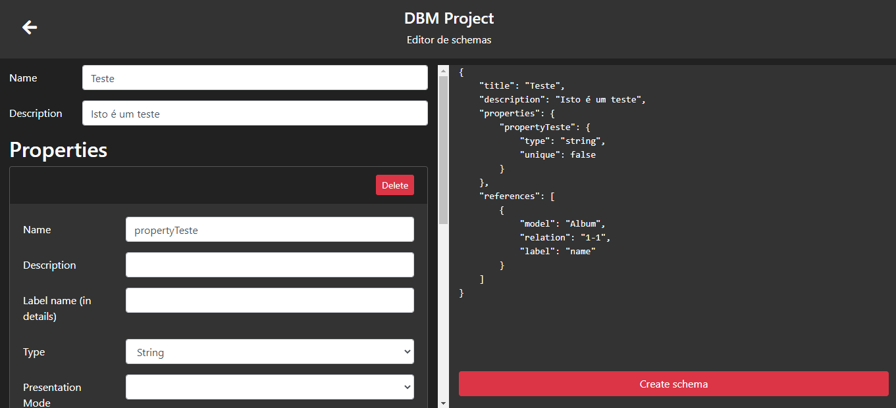

Podemos dizer que a página está dividida em 2 partes sendo que a esquerda é a parte de formulário, ou seja, inserção de dados e a parte direita é a preview do schema que está a ser criado através do formulário.  
Sendo que a parte da esquerda é dinâmica no sentido em que ao premir nos botões "Add" irá ser adicionado um novo formulário para uma nova propriedade/referência que poderá ser preenchido com informação relativa a essa nova propriedade/referencia.  
Em relação ao preview há direita o mesmo é "live" ou seja atualiza enquanto o utilizador está a escrever nos formulários.

Devemos ainda mencionar que existem algumas validações relativamente á criação de um novo schema, sendo estas:

-   O schema deve sempre possuir um nome
-   O schema deve possuir um nome único
-   O schema deve possuir pelo menos um propriedade
-   O schema deve possuir pelo menos uma propriedade required
-   Todas as propriedades devem possuir um nome
-   Não pode existir propriedades com o mesmo nome

#### Style switcher

Relativamente á segunda opção que é o Style switcher, aqui poderão ser alterados os estilos da aplicação que irá ser gerada.  
Similarmente ao editor de esquemas possui 2 partes onde a esquerda é o formulário para alterar os estilos e a parte direita é a preview tambem "live" que atualiza automáticamente.  
No formulário é possivel alterar diversos estilos da página sendo que os que são suportados são os seguintes:

Estilos de fundo

-   Padrão de fundo
-   Cor do fundo (Background color)
-   Cor do padrão (Foreground color)
-   Opacidade do padrão

Estilos de texto

-   Fonte do texto
-   Tamanho do texto
-   Cor do texto

Estilos de butões

-   Fundo do botão
-   Cor do texto do botão

Estilos de tabelas

-   Cor de fundo dos cabeçalhos
-   Cor do texto dos cabeçalhos
-   Cor de fundo do corpo da tabela
-   Cor do texto do corpo da tabela
-   Cor da borda

Estilos da navbar:

-   Alinhamento do texto
-   Cor do fundo
-   Cor do texto

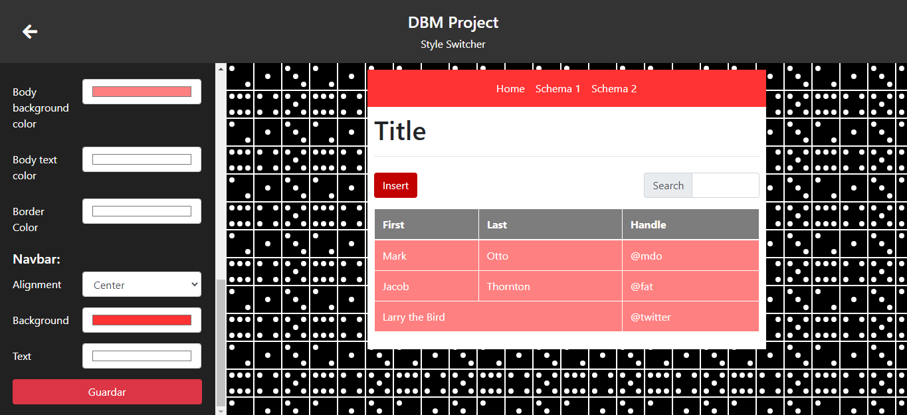

#### Frontoffice views

Em relação á terceira opção temos as views do frontoffice ou seja aqui puderão ser geridas as tabelas que serão mostradas na página inicial da aplicação gerada.

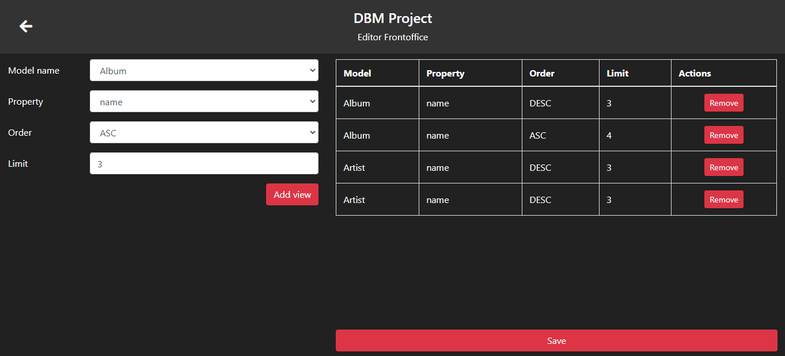

Como pode ser observado temos novamente uma estrutura similar ás anteriores, á esquerda encontra-se o formulário para adicionar uma nova view enquanto há direita encontra-se uma tabela com todas as views criadas. Cada entrada desta tabela possui um botão de delete para remover a respetiva view.  
Após estar satisfeito é só clicar no botão de salvar no canto inferior direito.

#### Publish and Generate

Por fim temos a opção final e mais importante que é a que inicia a geração em si da aplicação.  
Esta opção irá mostrar um modal que irá ficar em loading enquanto a aplicação está a ser gerada e em seguida irá aparecer se foi bem sucedido uma mensagem de sucesso com um botão para redirecionar o utilizador para o url "localhost:8082".

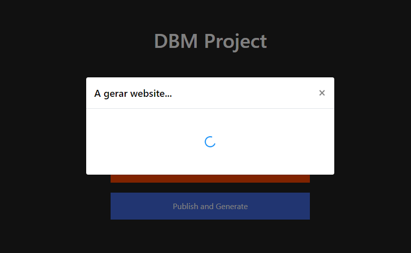

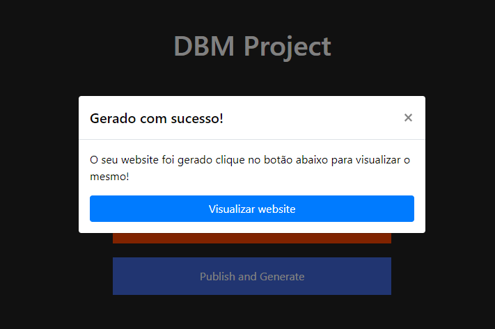

### Utilização do programa (Aplicação gerada)

#### Inicialização da página gerada

Embora a página gerada irá ser inicializada automáticamente após a geração da mesma achamos por bem explicar que após esta tenha sido gerada esta puderá ser facilmente inicializada independentemente. Para tal é apenas necessário dirigir-se á pasta "publish" e correr o comando `node index` no terminal.  
Isto irá inicializar o servidor web (página gerada) no seu computador ao qual puderá aceder através de um browser dirigindo-se ao url "localhost:8082".

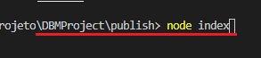

#### Página inicial

Começando pela página inicial considerada o frontoffice da aplicação gerada. Nesta página é possivel visualizar algumas tabelas com uns registos (com ordenação por propriedade e limite nº de registos) definidos anteriormente no gerador na parte de frontoffice views.

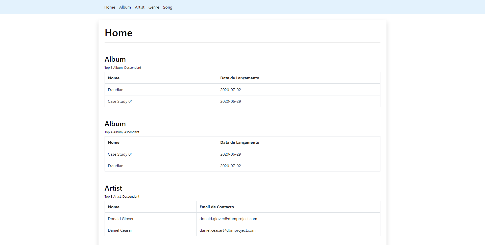

#### Página de listagem de instancias de uma entidade

Ao pressionar numa das opções disponiveis na barra de navegação no topo é possivel ir para uma listagem de todos os registos dessa entidadade como pode ser observado na figura abaixo.

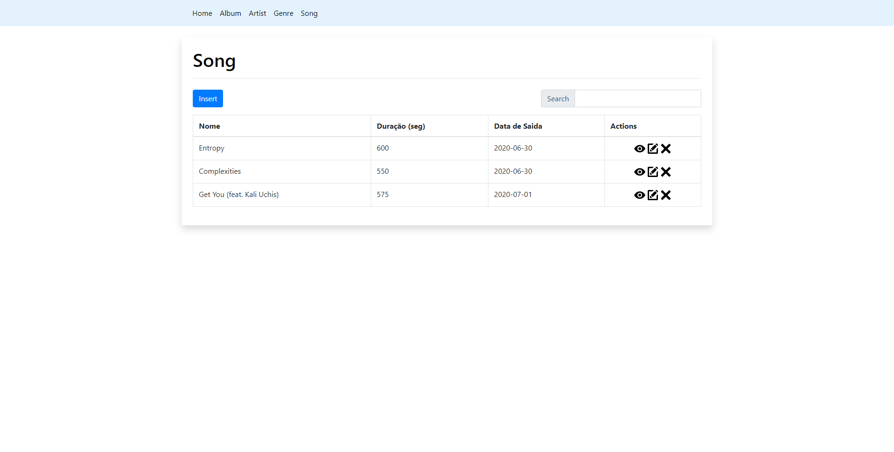

Nesta listagem cada registo possui algumas ações disponiveis sendo estas visualizar detalhes, editar, e apagar o registo.  
É possivel tambem a criação de um novo registo, esta pode ser acedida pressionando o botão acima da listagem que diz "Insert".  
A ação de apagar será a unica das 3 que será "instantanea", ou seja, esta irá apagar o registo diretamente da tabela sem fazer um redirecionamento para outra página.  
Quanto ás ações de visualizar os detalhes e editar, estas serão mostradas em detalhe nas proximas secções.  
Por fim nesta página existe ainda uma funcionalidade de pesquisa sobre os registos existentes na tabela.

#### Página de criação de uma instancia de uma entidade

Esta é uma página normal de criação de um registo, é um simples formulário com todos os campos que aquela entidade possui. Quanto á sua utilização basta apenas preencher os campos (pelo menos os obrigatorios) e pressionar o botão que se encontra no fim da página com o nome "Save".

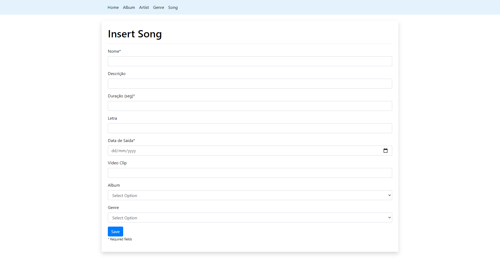

Caso ocorra algum erro na inserção irá ser mostrado um modal com uma mensagem de erro.

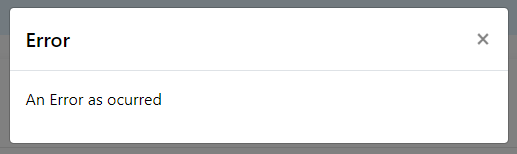

#### Página de detalhes de uma instancia de uma entidade

Após pressionar a ação de visualizar detalhes que é representada por um olho é redirecionado para esta página:

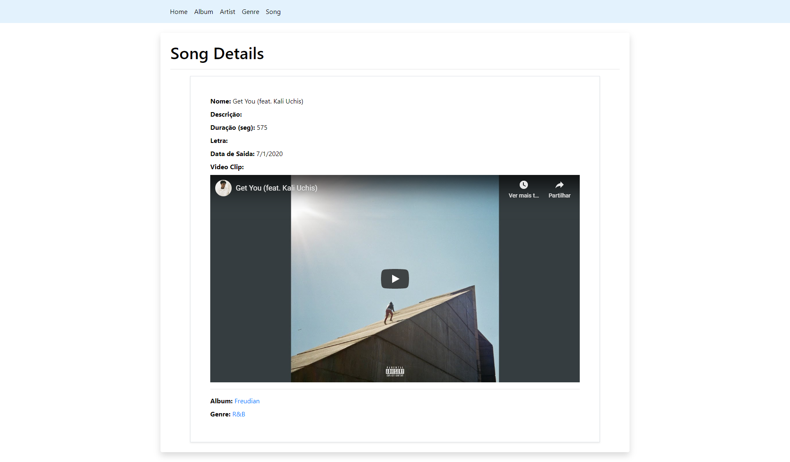

Nesta página é possivel visualizar todos os detalhes referentes ao registo.
É tambem possivel, caso esta entidade possua relações com outra,existir um link que irá redirecionar para os detalhes do registo associado a este.

#### Página de edição de uma instancia de uma entidade

Após pressionar a ação de editar que é representada por um lápis é redirecionado para esta página:

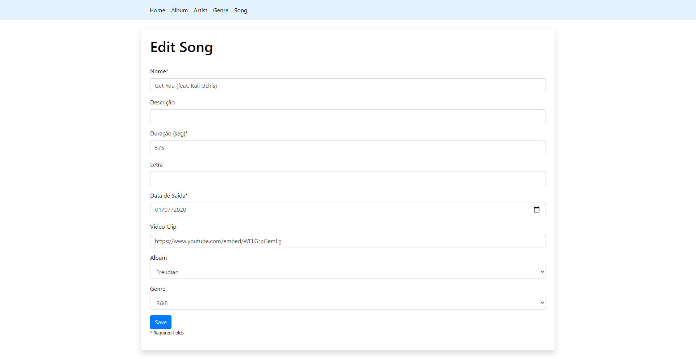

Esta página é similar á página de criação falada anteriormente mas em vez do formulário se encontrar vazio este vem preenchido com os detalhes do registo.
